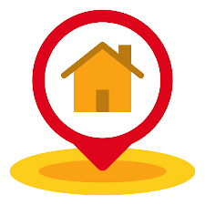

<h1 align="center">PinPoint Earth</h1>
<p align="center">A worldwide map location and decentralized blog dapp on ArWeave!</p>
<p align="center">This projects uses common web techonologies and being built on the Arweave Blockweave</p>

---

## A Global-Pinpoint And Decentralized Blogging Application `PinPoint Earth`

PinPoint Earth is an innovative mobile application designed to help users explore, navigate, and interact with the world around them, users can take photos and document a moment at a specific location, the decentralized blog post feature to write documemtations and articles etc. The app leverages advanced mapping technology and location-based services to provide a wide range of features and functionalities. 

A little background on Arweave

Arweave stands out due to its distinctive role as both our storage and application service, operating in a decentralized manner. In our application, we utilize Arweave for data reading and writing, as well as deploying the application's code onto Arweave, enabling app delivery through web browsers. While this concept might initially require some comprehension, Arweave functions through nodes and gateways. The nodes oversee storage and blockweave aspects, whereas the gateways manage Cache, RPC API, and Query functionalities. It's within the gateway that the true magic happens for our decentralized applications. Through metadata tags like 'Content-Type,' data storage allows us to guide gateway servers in data presentation. Consequently, a web browser can seamlessly interact with our application, almost as if the gateway were a web server.
## What makes Arweave the choice for web3?

Arweave operates on a blockweave architecture, akin to a blockchain. However, what sets Arweave apart is its ability to accommodate transactions of varying sizes, a marked departure from traditional blockchains. This characteristic establishes a distinct and unparalleled attribute compared to other layer 1 networks. With Arweave, you acquire a combined cloud development and hosting platform. Arweave aligns with web standards, encompasses smart contracts, Profit Sharing Tokens (Token), Profit Sharing Communities (DAO), and NFTs (Non-Fungible Tokens). The beauty of the system is that you can harness these functionalities using a wide array of programming languages. If you're a full stack developer accustomed to technologies like javascript, graphql, and APIs, you possess the skills necessary to flourish within the Arweave ecosystem.

## Prerequisites

* NodeJS/npm/Javascript - https://nodejs.com
* Git/Github - https://github.com
* JSON/GraphQL - https://graphql.org
* Mapbox account - https://www.mapbox.com/

> Create a free mapbox account to take advantage of the mapping and geocoding features. You will need a free developer public API key. https://www.mapbox.com

## Setup

For the curious minded folks;

Fork the following repository: https://github.com/Ignatiusdork/arweaveHack/tree/main, then clone it to your local environment, or spin it up in gitpod: https://gitpod.io#[your forked repo]

Open a terminal window in the project directory and run:

```
yarn
```

Create a `app/.env`, the `.env` file will setup our environment settings for the application, we need to specify the following settings:

> NOTE: make sure you create your `.env` file in the `app` directory.

`app/.env`

```
VITE_MAPBOX=MAPBOX_TOKEN_HERE
VITE_ARWEAVE_PORT=1984
VITE_ARWEAVE_PROTOCOL=http
VITE_ARWEAVE_HOST=localhost
```

---

## Arweave DevTools

* Arkb
* ArLocal
* ArweaveJS
* ArweaveWalletConnector

These are a list of tools that we will be using from the Arweave ecosystem to help us with our application, 

Arlocal allows us to run a `devnet` local Arweave gateway/node, to iterate on our development locally. https://github.com/textury/arlocal

> Arlocal is a great tool, I have not found any differences between my interaction with arlocal and the arweave.net, when my code works with arlocal, I am 100% confident it will work on arweave.net.

ArweaveJS is a javascript library that provides us with the APIs to post data on the weave and query data from the weave using `GraphQL`. https://github.com/ArweaveTeam/arweave-js

> Arweave js abstacts the JSON RPC api and wraps the commands using a javascript friendly promised based api, so you can generate wallets, create, sign, and post transactions.

ArweaveWalletConnector is a module that allows us to connect with the wallet application called `arweave.app`. https://github.com/jfbeats/ArweaveWalletConnector

> Arweave wallet connector interacts with the arweave.app wallet and gives you the connect, disconnect and several wallet connection events.


Arkb is a command-line application that publishes our web application to the permaweb. https://github.com/textury/arkb

> arkb allows you to deploy your web application to the permaweb the layer on top of the arweave network that is managed by arweave gateways, the permaweb uses the tags on the arweave transaction to serve up specific transactions in the web browser. This technology allows you to deploy any web asset as a blockweave transaction.

---

## Setting up Arlocal

Arlocal is a local server that implements the same API as the Arweave network, this enables you to develop locally then when ready deploy your app to https://arweave.net.

It is easy to setup, you simply install it from npm and setup a script for you to start the server.

```
npx arlocal
```

You can find out more about Arlocal in its repository - https://github.com/textury/arlocal - check out the readme, it has some cool options that you may be interested in, like running on a different port, or hiding the logs, or running programatically.

Open another terminal window and run:

```
yarn load-data
```

```
node publish-blog
```

> This command is just setting up some transactional data for us to play with.

---

## Querying ArWeave

One of the most fascinating aspects of Arweave is that the gateway server seamlessly supports GraphQL right from the start! Yes, you heard it right. GraphQL can be used to query the blockweave right out of the box!

Ensure that your arlocal server is up and running. Then, navigate your browser to http://localhost:1984/graphql. A screen will pop up prompting you to launch the Apollo GraphQL visual tool. Click on this button, and you'll find yourself in the GraphQL query environment. Exciting, isn't it? ⭐️

This environment empowers you to craft GraphQL queries and execute them against your arlocal server. As an illustration, let's go ahead and run this query:

``` gql
query {
  transactions (tags: {
    name: "App-Name"
    values: ["PinPoint Earth"]
  }) {
    edges {
      node {
        id
        tags {
          name
          value
        }
        data {
          size
        }
        block {
          id
        }
      }
    }
  }
}
```

You should see some results like:

``` json
{
  "data": {
    "transactions": {
      "edges": [
        {
          "node": {
            "id": "wOFui-eLxA8DKjgzUI9JDopa-EN9ARCxiG2oTcL0qjM",
            "tags": [
              {
                "name": "App-Name",
                "value": "PinPoint Earth"
              },
              {
                "name": "Version",
                "value": "0.1"
              },
              {
                "name": "Content-Type",
                "value": "image/png"
              },
              {
                "name": "title",
                "value": "Grand Central Terminal, NYC"
              },
              {
                "name": "location",
                "value": "33.074600,-79.762800"
              },
              {
                "name": "timestamp",
                "value": "2022-03-30T19:02:52.716Z"
              }
            ],
            "data": {
              "size": "15720267"
            },
            "block": {
              "id": "r7983ilr0sxvlwz2boo04luf9olhppqxee81dn9iqq67pnj7kugudi0iod89wv8w"
            }
          }
        }
      ]
    }
  }
}
```

When we post our transaction with tags, we can use those tags as selectors in our Graphql 
queries to filter our query requests. In our above example, we are using the tag name `App-Name` and the tag value `PinPoint Earth` as selector criteria in our Graphql query. 

---


## Discussing About The PinPoint Earth Protocol Concepts

Given that Arweave operates as a decentralized framework for storing data, it offers an opportunity to transform into your own cloud backend. The mechanism involves crafting a blueprint for your data, much akin to a schema within a database. This blueprint defines the structure of your data, tailored to your application's needs. A pivotal component of an Arweave transaction is composed of various attributes, with the data and tags properties being particularly pertinent to our protocol design.

Arweave empowers the creation of tags for every transaction, albeit with a collective tag data capacity of 2048 bits. This assortment of tags can be strategically employed to facilitate query-friendly transactions using GraphQL. For our PinPoint Earth protocol, the objective centers on efficiently listing transactions on a map. Our GraphQL query mandates the provision of location data and titles. Moreover, we aspire to apply timestamp-based filtration to the listing. To this end, incorporation of timestamps into our tag specifications becomes imperative.

```
data: image
tags:
  App-Name: 'PinPoint Earth' // constant
  Protocol: 'PinPoint Earth' // constant
  Content-Type: 'image/png|jpg|gif' // only support images
  Title: 'Title of Pin' // limit 20 characters
  Description: 'Description of Pin' // limit 100 characters
  Location: 'lat, lng' // Latitude, Longitude 
  Timestamp: '' // new Date.toISOString()
```

With this simple protocol, anyone can drop a pin in any application, and  will be able to find it and show it on a map.

### Model Schema

Our primary aim is to establish a robust validation procedure that ensures the alignment of transactions originating from Arweave with our protocol. Equally important is the capability to generate transactions that can be both signed and uploaded onto the Arweave network. This particular schema model serves the purpose of validating our data in the context of PinPoint Earth.

We will use `zod` to create a schema check:

``` js
import { z } from 'zod'

const schema = z.object({
  id: z.string(),
  title: z.string().max(20),
  description: z.string().max(100),
  location: z.string().max(50),
  timestamp: z.string().max(50)
})
```

``` js
export const pinFromTx = (tx) => {

  try {
    return schema.parse({
      id: tx.id,
      title: (tx.tags.find(t => t.name === 'Title')).value,
      description: (tx.tags.find(t => t.name === 'Description')).value,
      location: tx.tags.find(t => t.name === 'Location').value,
      timestamp: tx.tags.find(t => t.name === 'Timestamp').value
    })
  } catch (e) {
    console.log(e)
    return null
  }
}

export const formToTx = (formData) => {
  return {
    data: formData.photo,
    tags: [
      { name: 'App-Name', value: 'PinPoint Earth' },
      { name: 'Protocol', value: 'PinPoint Earth' },
      { name: 'Title', value: formData.title },
      { name: 'Location', value: formData.location },
      { name: 'Description', value: formData.description },
      { name: 'Timestamp', value: formData.timestamp }
    ]
  }
}
```

### Model Schema For The Blog Section

This particular schema model serves the purpose of validating our data in the context of the blog for PinPoint Earth.

``` js

  $: data = {
    blogs: [],
    loading: true,
  };

  $: blog_active_states = {};

  async function loadData() {
    const addr = "vVvN5qZ-KSno5hpsK_t2B-6gq2XGDENX3_ZE1HzzGs4";
    var res = await getAllTxFromID(addr);
    let _blogs = [];
    await res.forEach(async (element) => {
      let tx_details_res = await fetchTransaction(element.node.id);
      const decoder = new TextDecoder("utf-8");
      const decodedData = decoder.decode(tx_details_res.data);
      blog_active_states[element.node.id] = false;
      data.loading = false;
      _blogs.push({
        title: tx_details_res.tags[0].value,
        body: decodedData,
        id: element.node.id,
        isActive: false,
      });
      console.log(_blogs);
    });
    data.blogs = _blogs;
  }

  loadData();
```

### Summary

Shifting from web2 to web3 brings a unique challenge: transitioning from a model-based approach to a protocol-focused mindset. When making this shift, it's crucial to maintain a streamlined and straightforward protocol schema. This simplicity is key, as it allows for easy future expansions by creating new protocols and combining them as needed. Additionally, a vital step is consistently validating incoming data from the blockweave to ensure accuracy and integrity.


---

## Integrating Arweave-js

Arweave-js is the official javascript/typescript library for interacting with Arweave Blockweave. 

### install arweave-js

```
cd app
yarn add arweave
```

Create a new file called `arweave.js` in the `app/src` folder

``` js
import Arweave from 'arweave'

// we want to use a `.env` file for arlocal and if not set, then use
// arweave.net for production
const arweave = Arweave.init({
  host: import.meta.env.VITE_ARWEAVE_HOST || 'arweave.net',
  port: import.meta.env.VITE_ARWEAVE_PORT || 443,
  protocol: import.meta.env.VITE_ARWEAVE_PROTOCOL || 'https'
})
```

> Import the arweave module and initialize our arweave constant using the `.env` variables or default to mainet. Mainet 
> is the production version of Arweave's network.

Below the init block we will add our first arweave function:

``` js
export const activity = async () => {
  try {
    const result = await arweave.api.post('graphql', {
      query: `
query {
  transactions (first: 100, tags: { name: "Protocol", values: ["PinPoint Earth"] }) {
    edges {
      node {
        id
        tags {
          name
          value
        }
      }
    }
  }
}
    `
    })
    return result?.data?.data?.transactions?.edges
  } catch (e) {
    return []
  }
}
```

This function will query the Arweave network for all of the PinPoint Earth pins and return the most recent 100 pins dropped and all blog posts on the network if any using Graphql. You will notice the result returns two nested data objects, then transactions, and edges.

---

## Posting transactions

Now we are ready to create our first earth pin. Before we do that, lets mint some ar tokens for our local environment.

// https://[arlocal url]/mint/address/[winston 1000000000000000]

// Arweave.js

Lets build an Arweave transaction, we will use Arweave.js to build it.

``` js

export const submit = async ({ data, tags }) => {
  // 1. Wallet not Connected!
  if (window?.arweaveWallet === undefined) {
    return { ok: false, message: 'Wallet not connected!' }
  }

  const balance = await getBalance(await window.arweaveWallet.getActiveAddress())

  try {
    const tx = await arweave.createTransaction({ data })
    tags.map(({ name, value }) => tx.addTag(name, value))
    await arweave.transactions.sign(tx)
    // 2. check reward and wallet balance
    if (Number(tx.reward) > Number(balance)) {
      return { ok: false, message: 'Not Enough AR to complete request!' }
    }
    const uploader = await arweave.transactions.getUploader(tx)
    return { ok: true, uploader, txId: tx.id }
  } catch (e) {
    return { ok: false, txId: tx.id, message: e.message }
  }
}
```
## Posting transactions(Blogs)

``` js

 let key;
 const addr = await arweave.wallets.jwkToAddress(key)
    const tokens = arweave.ar.arToWinston(1)
    // mint some tokens
    await arweave.api.get(`mint/${addr}/${tokens}`)
    await arweave.api.get('mine')

    tx = await arweave.createTransaction({
        data: data3, tags: [new Tag('blog_title', 'Arweavely Hack')]
    }, key)

    await arweave.transactions.sign(tx, key)
    console.log(tx.id)
    uploader = await arweave.transactions.getUploader(tx)
    while (!uploader.isComplete) {
        await uploader.uploadChunk()
    }
    await arweave.api.get('mine')
```

This function will take care of the create, sign and upload of our arweave transaction, and using our pin model we can validate the form entry data and convert to a `transactionObject` this is just a simple object that can be sent to the the submitTx function.

Next, we need to add a waitfor function, this function will gracefully check the Arweave gateway for a status on the processing of a transaction. Once the transaction is uploaded, we need verification from the gateway that the transaction has been accepted.

``` js
export const waitfor = async (txId) => {
  let count = 0;
  let foundPost = null;

  while (!foundPost) {
    count += 1;
    console.log(`attempt ${count}`);
    await delay(2000 * count);
    const result = await arweave.api.post('graphql', {
      query: `
query {
  transaction(id: "${txId}") {
    id
  }
}
    `});
    foundPost = result.data.data.transaction.id === txId;
    if (count > 10) {
      break; // could not find post
    }
  }
  return foundPost
}
```

### Get Single Transaction

In order to view our newly saved transaction, we need to implement the getTx function in the `src/arweave.js` file.

`src/arweave.js`

``` js
export const getTx = async (id) => {
  try {
    const result = await arweave.api.post('graphql', {
      query: `
  query {
    transaction(id: "${id}") {
      id
      owner {
        address
      }
      tags {
        name
        value
      }
    }
  }
      `
    })
    return result?.data?.data?.transaction
  } catch (e) {
    return null
  }
}
```

### Get Single Transaction(Blogs)

```js

  const getAllTxFromID = async (id) => {
    try {
      const result = await arweave.api.post('graphql', {
        query: `
      query {
          transactions(owners: ["${id}"]) {
            edges {
              node {
                id
              }
            }
          }
        }
      `
      })
      return result?.data?.data?.transaction
    } catch (e) {
      return null
    }
  }

```

---

## Summary

Yeeh! We have reached the end of explaning the core concepts of the PinPoint Earth dApp. in this breakdown we covered:

* how to use arlocal for development
* how to use graphql to query the blockweave
* how to work with arweave-js to create, sign and post a transaction
* how to think in terms of protocols as data models
* how to submit a PinPoint Earth transaction and wait for the response

There's a wealth of untapped potential within Arweave, and this marks only the initial phase of our journey into exploration!